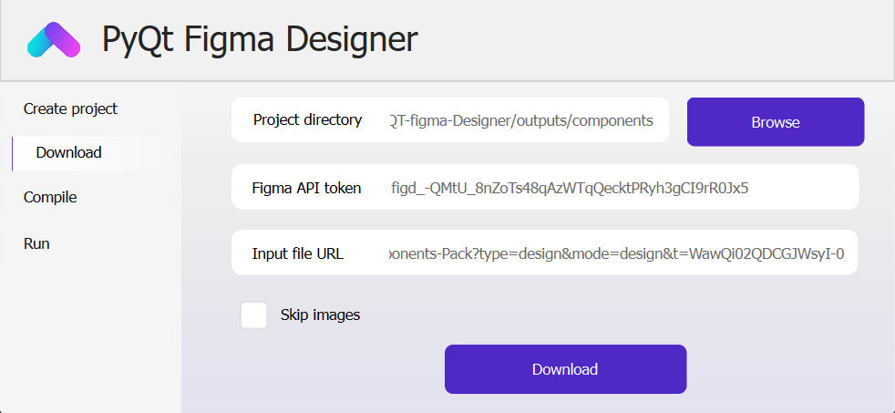
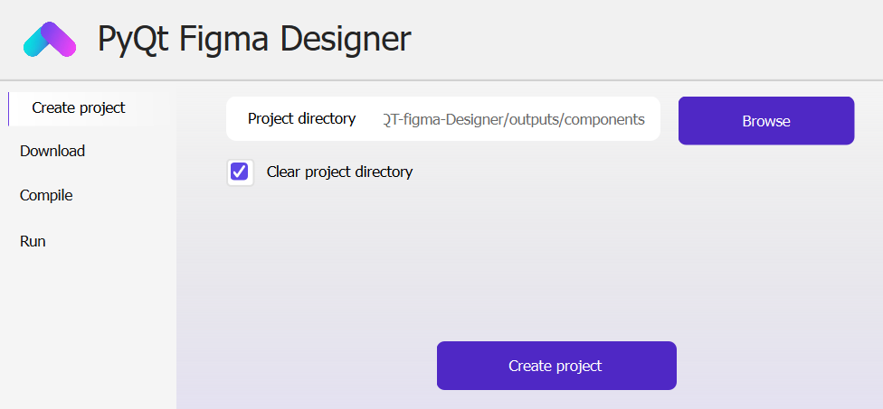
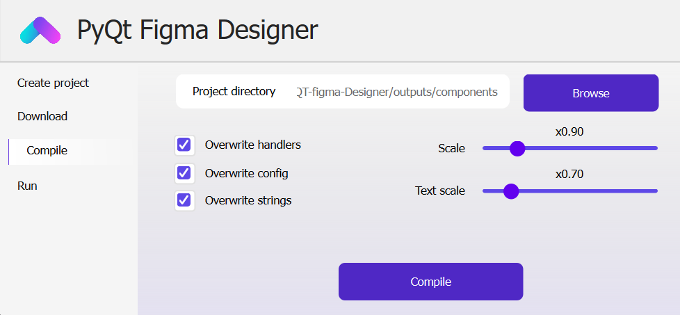
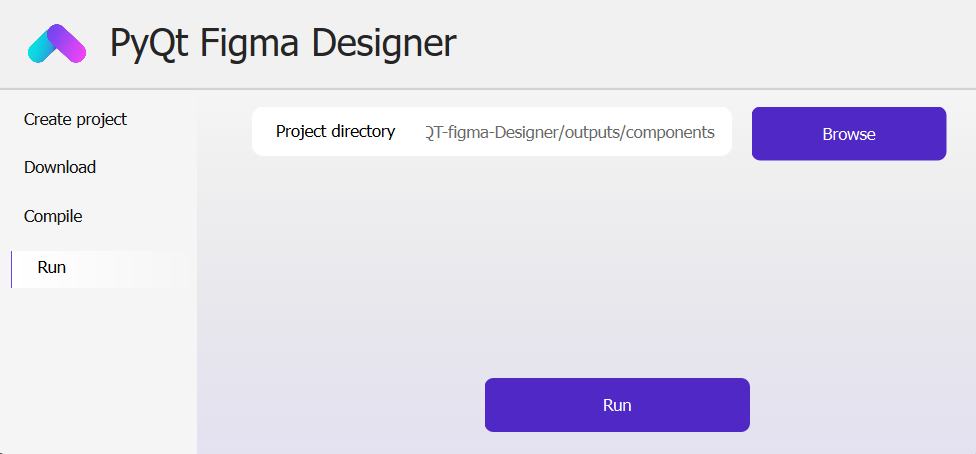
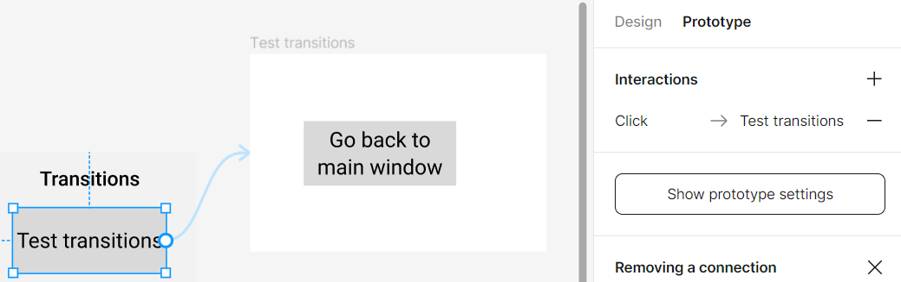
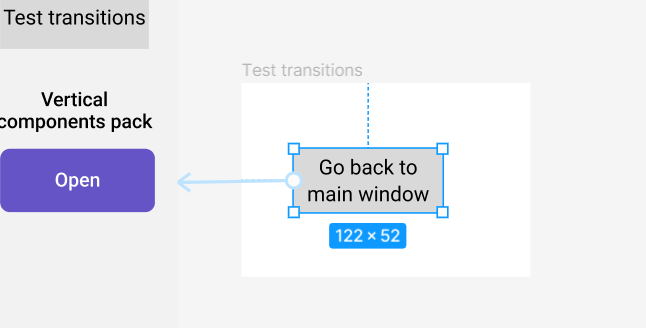
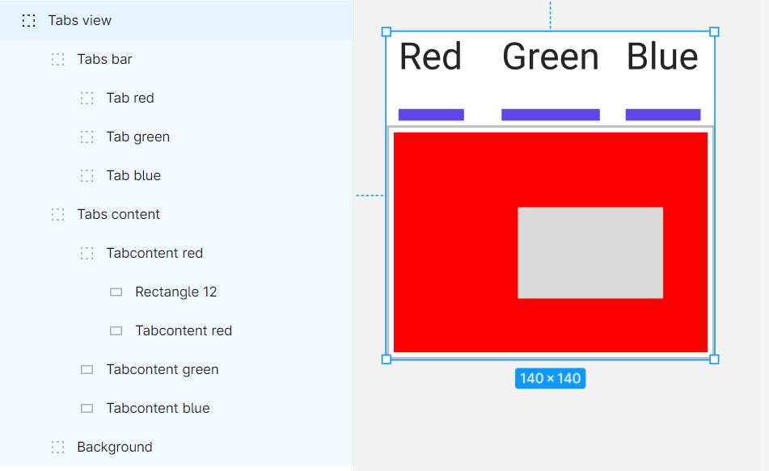

# PyQt Figma Designer

## Overview

PyQt Figma Designer is a powerful tool designed to streamline the process of converting Figma files into PyQt6 code,
enabling the rapid development of professional graphical user interfaces (GUIs). Leveraging the Figma API, this project
offers a comprehensive solution for creating GUIs with PyQt6, using high-quality SVG components.



## Installation

Follow these steps to install PyQt Figma Designer on your system:

1. Clone the repository to your local machine:

   ```bash
   git clone https://github.com/rombirli/PyQT-Figma-Designer.git
   cd PyQt-Figma-Designer
   ```

2. Install the required Python packages using pip:

   ```bash
   pip install -r requirements.txt
   ```

3. Create a personal access token for Figma by following the
   instructions [here](https://www.figma.com/developers/api#access-tokens).

## Usage

### Graphical User Interface (GUI)

1. Launch the GUI with the following command:

   ```bash
   python pyqtfd-gui.py
   ```

2. In the "Create project" tab input the path to an empty directory where the project will be created. Click the "Create
   project" button to create the project.
   

3. Switch to the "Download" tab, input your Figma personal access token and the Figma file URL. Click the "Download"
   button to download the Figma file.
   

4. Switch to the "Compile" tab and click the "Compile" button to generate the PyQt6 code.
   

6. Switch to the "Run" tab and click the "Run" button to run the generated GUI.
   

### Command Line Interface (CLI)

#### Creating new project

```bash
python pyqtfd-create.py -h
```

This command allows you to create a new PyQt-Figma-Designer project. It accepts the following options:

- `-p PATH, --project PATH`: Specifies the project directory where the generated files will be stored.
- `-c, --clear`: (Optional) Clears the project directory before generating the project.

Example usage:

```bash
python pyqtfd-create.py -p <project_directory> -c
```

#### Downloading Figma Files

```bash
python pyqtfd-download.py -h
```

This command allows you to download a Figma file as well as its images. It accepts the following options:

- `-p PATH, --project PATH`: Specifies the project directory where the generated files will be stored.
- `-url URL, --url URL`: Specifies the Figma file URL.
- `-t TOKEN, --token TOKEN`: Specifies the Figma personal access token.
- `-ni, --no-images`: (Optional) When specified, images are not downloaded.

Example usage:

```bash
python pyqtfd-download.py -p <project_directory> -t <Figma_token> -url <Figma_URL>
```

#### Compiling PyQt-Figma-Designer Projects

```bash
python pyqtfd-compile.py -h
```

This command allows you to compile a PyQt-Figma-Designer project into a Python project. It accepts the following
options:

- `-p PATH, --project PATH`: Specifies the project directory where the PyQt-Figma-Designer project is located.
- `-s SCALE, --scale SCALE`: (Optional) Specifies the scale for the Figma components.
- `-ts TEXT_SCALE, --text-scale TEXT_SCALE`: (Optional) Specifies the scale for the Figma text components.
- `-owh, --overwrite-handler`: (Optional) When specified the `gui_handler.py` file is
  overwritten.
- `-owc, --overwrite-config`: (Optional) When specified the `components_config.py` file is
  overwritten.
- `-ows, --overwrite-strings`: (Optional) When specified the `strings.py` file is
  overwritten.

Example usage:

```bash
python pyqtfd-compile.py -p <project_directory> -s <scale>
```

These CLI commands provide flexibility and automation for working with PyQt Figma Designer, allowing you to efficiently
download Figma files and compile them into Python projects. For additional details on these commands, refer to the
provided help information.

### Generated Files

#### GUI

The main GUI file, `gui.py`, is generated in the output directory. Avoid editing this file, as it will be overwritten
during recompilation. Run this file to launch the generated GUI.

#### GUI Handler

The `gui_handler.py` file, also generated in the output directory, contains a class hierarchy that mirrors the Figma
file's structure. You can extend and customize these classes as needed, but be cautious not to overwrite them during
recompilation.

#### GUI Controller

Similarly, the `gui_controller.py` file in the output directory contains a class hierarchy representing the Figma file's
structure. Your code should call functions within these classes to update the GUI. Avoid editing this file to prevent
overwriting during recompilation.

#### Strings

The `strings.py` file in the output directory contains all the strings used in the GUI. You can edit this file to
translate it into another language, but be cautious not to overwrite it during recompilation.

#### Components Config

The `components_config.py` file in the output directory contains the configuration for the components. You can edit this
file to change the default values of the components, as well as their color, but be cautious not to overwrite it during
recompilation.

#### Figma Files

The downloaded Figma file is saved in the output directory as `figma_file.json`. Additionally, project images are
stored in the `images` subdirectory in png format.

#### SVG Files

SVG files are generated during compilation and can be found in the `svg` subdirectory. These SVG files are crucial for
displaying each GUI component.

## Supported Components

PyQt Figma Designer supports various components, each with specific naming conventions and hierarchies. To ensure proper
functionality, follow these guidelines:

### Components pack

For a quick components overview, you can access the Component
Pack [here](https://www.figma.com/file/AZD7bWnCwce9uAuTqa6aY5/Untitled?type=design&node-id=0%3A1&mode=design&t=0jee9KtQMinbOkMd-1)


### Windows & Transitions

To create a window, place a frame at the root level of the Figma file. The frame will be automatically converted into a
window (`QWindow` class). The first frame in the Figma file (bottom-most) will be the main window. The main window will
be automatically
displayed when the GUI is launched (`python gui.py`). Other windows will be hidden by default and can be displayed using
Figma transitions. Your transition must start from a button or a custom button (see below) and end at a root
level frame. Here is an example of a transition from a button to a window:

Any transition to a window that is still open will close the window that is currently open.
You can use this to create a back button that closes the current window and returns to the previous one.


### Naming Conventions

Component names must start with a prefix indicating their type. Component names are case-insensitive and disregard
spaces, dashes, and underscores (`  , -, _`).
The prefix of some components can be preceded by the letter v or h to indicate vertical or horizontal orientation. For
example, a vertical slider would have the prefix `vslider`.

| Component Type    | Prefix            |
|-------------------|-------------------|
| Button            | button            |
| Custom Button     | custombutton      |
| Text Field        | textfield         |
| Custom Text Field | customtextfield   |
| Checkbox          | checkbox          |
| Tabs view         | tabsview          |
| Slider            | (v/h) slider      |
| Progress Bar      | (v/h) progressbar |
| Scroll View       | (v/h) scrollview  |

### Hierarchy and Ordering

Some components require specific hierarchies to function correctly:

#### Button & Text Field

No specific hierarchy is needed for these components. Ensure correct naming.

#### Custom Button

The custom button group should follow this ordering:

| Child Index  | Child Function |
|--------------|----------------|
| -1 (Topmost) | MouseOver      |
| -2           | Pressed        |
| -3           | Disabled       |
| -4           | Normal         |
| ...          | Background...  |

Here is an example of a custom button group in Figma:


#### Custom Text Field

For custom text fields, maintain the following order:

| Child Index  | Child Function   |
|--------------|------------------|
| -1 (Topmost) | Text (for style) |
| -2           | Hint             |
| ...          | Background...    |

#### Checkbox

The checkbox group should be ordered as follows:

| Child Index  | Child Function |
|--------------|----------------|
| -1 (Topmost) | Checked        |
| ...          | Background...  |

#### Tabs View

The tabs view group requires the following ordering:

| Child Index  | Child Function |
|--------------|----------------|
| -1 (Topmost) | Tabs bar       |
| -2           | Tabs content   |
| ...          | Background...  |

Ensure that the tabs bar contains buttons for switching between tabs (in the selected version), and tabs content holds
the respective tab content.

Here is an example of a tabs view group in Figma:


#### Slider

The slider group must follow this ordering:

| Child Index  | Child Function |
|--------------|----------------|
| -1 (Topmost) | Slider handle  |
| ...          | Background...  |

#### Progress Bar

For progress bars, maintain the following order:

| Child Index  | Child Function |
|--------------|----------------|
| -1 (Topmost) | Fill           |
| ...          | Background...  |

#### Scroll View

The scroll view group must follow this ordering:

| Child Index  | Child Function |
|--------------|----------------|
| -1 (Topmost) | Scroll bar     |
| -2           | Scroll content |
| ...          | Background...  |

The scrollbar group must follow slider ordering conventions.
The scroll view may be a frame inside a frame or a frame inside a group (for making content bigger than the scroll
view).

### Writing Custom Components

To create custom components for your GUIs, follow these steps:

1. **Create a Python File**: Begin by creating a new Python file in the `generator/design/components` directory. This
   file will serve as the container for your custom component class.

2. **Inherit from `ComponentGenerator`**: In your Python file, define a class that inherits from
   the `ComponentGenerator` class found in `generator.design.component_generator`. This class receives a GroupGenerator
   object as a parameter and keeps it. You can use this object
   to access the children of the group with the syntax `self.group_generator.children[index]`.

3. **Define Class Fields**:
    - `component_name`: This string field inherited from `ComponentGenerator` specifies the prefix used to identify
      the component in the Figma file. Ensure this prefix is unique, case-insensitive, and doesn't conflict with
      existing components.
    - `component_config` (Optional): This dictionary field inherited from `ComponentGenerator` allows you to populate
      the `component_config.py` file with additional configuration options. By default, this field should be an empty
      dictionary. You can use `generate_get_component_config` from `generator.utils` to access this configuration in
      your generated code.

4. **Define Class Functions**

    - `generate_design`: This function inherited from `DesignGenerator` is the first of the following functions called
      during compilation and allows you to
      generate the code for your component. This function should return an iterator of strings that will populate the
      function `setupUi` from the file `gui.py`.
    - `generate_handler` (Optional): This function inherited from `DesignGenerator` should
      return an iterator of strings that will populate the file `gui_handler.py`. You should generate handler functions
      using the function `generate_handler_function` from `generator.utils`. You must also call your handlers function
      that you
      define in `generate_design`.
      For this, you can use the function `generate_handler_call` from `generator.utils`.
    - `generate_controller` (Optional): This function inherited from `DesignGenerator` should
      return an iterator of strings that will populate the file `gui_controller.py`. You should generate controller
      functions
      using the function `generate_controller_function` from `generator.utils`. You must also setup (connect) your
      controller
      function that you define in `generate_design`. For this, you can use the function `generate_controller_setup`
      from `generator.utils`.

You can find many examples of custom components in the `generator/design/components` directory.

Feel free to read the documentation of the following modules and classes for more details :

1`generator.utils`

```bash
python -m pydoc generator.utils
```

2`generator.design.design_generator.DesignGenerator`

```bash
python -m pydoc generator.design.design_generator.DesignGenerator
```

3`generator.design.component_generator.ComponentGenerator`

```bash
python -m pydoc generator.design.component_generator.ComponentGenerator
```
