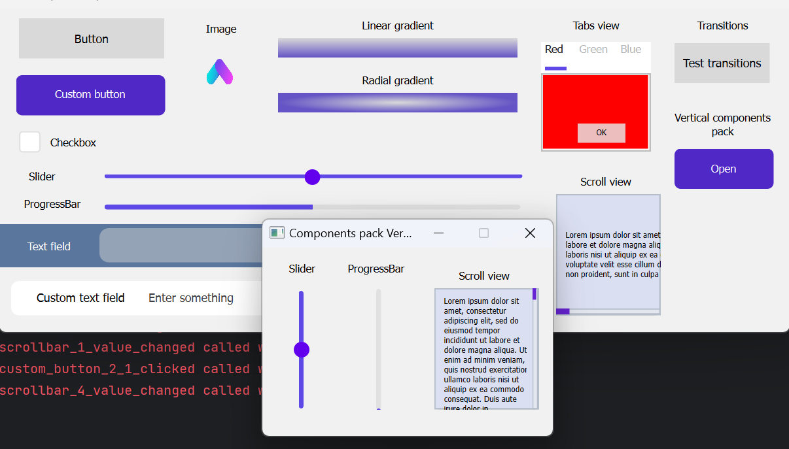

# PyQt Figma Designer

## Overview

PyQt Figma Designer is a powerful tool designed to streamline the process of converting Figma files into PyQt6 code, enabling the rapid development of professional graphical user interfaces (GUIs). Leveraging the Figma API, this project offers a comprehensive solution for creating GUIs with PyQt6, using high-quality SVG components.


## Installation

Follow these steps to install PyQt Figma Designer on your system:

1. Clone the repository to your local machine:

   ```bash
   git clone https://github.com/rombirli/PyQT-figma-Designer.git
   cd PyQT-figma-Designer
   ```

2. Install the required Python packages using pip:

   ```bash
   pip install -r requirements.txt
   ```

3. Create a personal access token for Figma by following the instructions [here](https://www.figma.com/developers/api#access-tokens).

## Usage

### Graphical User Interface (GUI)

1. Launch the GUI with the following command:

   ```bash
   python pyqtfd-gui.py
   ```

2. In the "Download" tab, input your Figma personal access token, the Figma file URL, and the desired output directory path.

3. Click "Create Project" to download the Figma file.

4. Switch to the "Compile" tab and click "Compile Project" to generate the PyQt6 code.

5. The generated code will be saved in the output directory. You can run the application by executing:

   ```bash
   python gui.py
   ```

### Command Line Interface (CLI)
### Command Line Interface (CLI)

#### Downloading Figma Files

PyQt Figma Designer provides a Command Line Interface (CLI) that enables you to conveniently download Figma files and generate PyQt-Figma-Designer projects. Here are the available CLI commands and their usage:

#### Downloading Figma Files

```bash
python pyqtfd-download.py -h
```

This command allows you to generate a PyQt-Figma-Designer project from a Figma URL. It accepts the following options:

- `-p PATH, --project PATH`: Specifies the project directory where the generated files will be stored.
- `-s SCALE, --scale SCALE`: (Optional) Specifies the scale for the Figma components.
- `-oh OVERWRITE_HANDLER, --overwrite-handler OVERWRITE_HANDLER`: (Optional) Specifies the overwrite handler.

Example usage:

```bash
python pyqtfd-download.py -p <project_directory> -t <Figma_token> -url <Figma_URL>
```

#### Compiling PyQt-Figma-Designer Projects

```bash
python pyqtfd-compile.py -h
```

This command allows you to compile a PyQt-Figma-Designer project into a Python project. It accepts the following options:

- `-p PATH, --project PATH`: Specifies the project directory where the PyQt-Figma-Designer project is located.
- `-s SCALE, --scale SCALE`: (Optional) Specifies the scale for the Figma components.
- `-oh OVERWRITE_HANDLER, --overwrite-handler OVERWRITE_HANDLER`: (Optional) When specified the `gui_handler.py` file is overwritten.

Example usage:

```bash
python pyqtfd-compile.py -p <project_directory> -s <scale> -oh <overwrite_handler>
```

These CLI commands provide flexibility and automation for working with PyQt Figma Designer, allowing you to efficiently download Figma files and compile them into Python projects. For additional details on these commands, refer to the provided help information.


### Generated Files

#### GUI

The main GUI file, `gui.py`, is generated in the output directory. Avoid editing this file, as it will be overwritten during recompilation.

#### GUI Handler

The `gui_handler.py` file, also generated in the output directory, contains a class hierarchy that mirrors the Figma file's structure. You can extend and customize these classes as needed, but be cautious not to overwrite them during recompilation.

#### GUI Controller

Similarly, the `gui_controller.py` file in the output directory contains a class hierarchy representing the Figma file's structure. Your code should call functions within these classes to update the GUI. Avoid editing this file to prevent overwriting during recompilation.

#### Figma Files

The downloaded Figma file is saved in the output directory as `figma_file.pickle`. Additionally, project images are stored in the `images` subdirectory.

#### SVG Files

SVG files are generated during compilation and can be found in the `svg` subdirectory. These SVG files are crucial for displaying each GUI component.

## Supported Components

PyQt Figma Designer supports various components, each with specific naming conventions and hierarchies. To ensure proper functionality, follow these guidelines:

### Components pack

For a quick components overview, you can access the Component Pack [here](https://www.figma.com/file/AZD7bWnCwce9uAuTqa6aY5/Untitled?type=design&node-id=0%3A1&mode=design&t=0jee9KtQMinbOkMd-1)


### Window

To create a window, place a frame at the root level of the Figma file. The frame will be automatically converted into a window.

### Naming Conventions

Component names must start with a prefix indicating their type. Component names are case-insensitive and disregard spaces, dashes, and underscores (`  , -, _`).

| Component Type    | Prefix          |
|-------------------|-----------------|
| Button            | button          |
| Custom Button     | custombutton    |
| Text Field        | textfield       |
| Custom Text Field | customtextfield |
| Checkbox          | checkbox        |
| Tabs view         | tabsview        |
| Slider            | slider          |
| Progress Bar      | progressbar     |

### Hierarchy and Ordering

Some components require specific hierarchies to function correctly:

#### Button & Text Field

No specific hierarchy is needed for these components. Ensure correct naming.

#### Custom Button

The custom button group should follow this ordering:

| Child Index  | Child Function |
|--------------|----------------|
| -1 (Topmost) | MouseOver      |
| -2           | Pressed        |
| -3           | Disabled       |
| -4           | Normal         |
| ...          | Background...  |

Here is an example of a custom button group in Figma:


#### Custom Text Field

For custom text fields, maintain the following order:

| Child Index  | Child Function   |
|--------------|------------------|
| -1 (Topmost) | Text (for style) |
| -2           | Hint             |
| ...          | Background...    |

#### Checkbox

The checkbox group should be ordered as follows:

| Child Index  | Child Function |
|--------------|----------------|
| -1 (Topmost) | Checked        |
| ...          | Background...  |

#### Tabs View

The tabs view group requires the following ordering:

| Child Index  | Child Function |
|--------------|----------------|
| -1 (Topmost) | Tabs bar       |
| -2           | Tabs content   |
| ...          | Background...  |

Ensure that the tabs bar contains buttons for switching between tabs (in the selected version), and tabs content holds the respective tab content.

Here is an example of a tabs view group in Figma:


#### Slider

The slider group must follow this ordering:

| Child Index  | Child Function |
|--------------|----------------|
| -1 (Topmost) | Slider handle  |
| ...          | Background...  |

#### Progress Bar

For progress bars, maintain the following order:

| Child Index  | Child Function |
|--------------|----------------|
| -1 (Topmost) | Fill           |
| ...          | Background...  |

By adhering to these naming conventions and hierarchies, you can make the most of PyQt Figma Designer's capabilities to create rich and functional PyQt6 GUIs.


