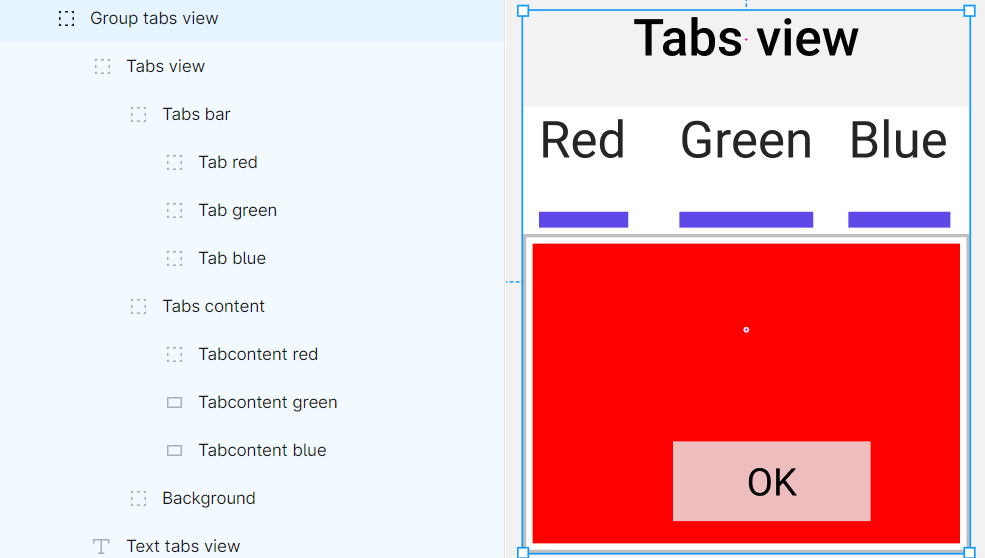

# PyQt Figma 设计师

## 概览

PyQt Figma 设计师是一个功能强大的工具，旨在简化将 Figma 文件转换为 PyQt6 代码的过程，使得使用高质量的 SVG 组件快速开发专业的图形用户界面（GUI）成为可能。利用 Figma API，该项目为使用 PyQt6 创建 GUI 提供了全面的解决方案。


## 安装

按照以下步骤在您的系统上安装 PyQt Figma 设计师：

1. 克隆仓库到您的本地计算机：

   ```bash
   git clone https://github.com/rombirli/PyQT-Figma-Designer.git 
   cd PyQt-Figma-Designer
   ```

2. 使用 pip 安装所需的 Python 包：

   ```bash
   pip install -r requirements.txt
   ```

3. 按照 [此处](https://www.figma.com/developers/api#access-tokens) 的说明创建 Figma 的个人访问令牌。

## 使用

### 图形用户界面（GUI）

1. 使用以下命令启动 GUI：

   ```bash
   python pyqtfd-gui.py
   ```

2. 在 "创建项目" 标签页输入一个空目录的路径，项目将在该目录创建。点击 "创建项目" 按钮来创建项目。
   

3. 切换到 "下载" 标签页，输入您的 Figma 个人访问令牌和 Figma 文件 URL。点击 "下载" 按钮来下载 Figma 文件。
   

4. 切换到 "编译" 标签页并点击 "编译" 按钮来生成 PyQt6 代码。
   

6. 切换到 "运行" 标签页并点击 "运行" 按钮来启动生成的 GUI。
   

### 命令行界面（CLI）

#### 创建新项目

```bash
python pyqtfd-create.py -h
```

此命令允许您创建一个新的 PyQt-Figma-Designer 项目。它接受以下选项：

- `-p PATH, --project PATH`: 指定项目目录，生成的文件将存储在此目录中。
- `-c, --clear`: (可选) 在生成项目之前清除项目目录。

示例用法：

```bash
python pyqtfd-create.py -p <项目目录> -c
```

#### 下载 Figma 文件

```bash
python pyqtfd-download.py -h
```

此命令允许您下载 Figma 文件及其图像。它接受以下选项：

- `-p PATH, --project PATH`: 指定项目目录，生成的文件将存储在此目录中。
- `-url URL, --url URL`: 指定 Figma 文件 URL。
- `-t TOKEN, --token TOKEN`: 指定 Figma 个人访问令牌。
- `-ni, --no-images`: (可选) 指定时，不下载图像。

示例用法：

```bash
python pyqtfd-download.py -p <项目目录> -t <Figma 令牌> -url <Figma URL>
```

#### 编译 PyQt-Figma-Designer 项目

```bash
python pyqtfd-compile.py -h
```

此命令允许您将 PyQt-Figma-Designer 项目编译成一个 Python 项目。它接受以下选项：

- `-p PATH, --project PATH`: 指定 PyQt-Figma-Designer 项目所在的项目目录。
- `-s SCALE, --scale SCALE`: (可选) 指定 Figma 组件的缩放比例。
- `-ts TEXT_SCALE, --text-scale TEXT_SCALE`: (可选) 指定 Figma 文本组件的缩放比例。
- `-owh, --overwrite-handler`: (可选) 指定时，`gui_handler.py` 文件将被覆盖。
- `-owc, --overwrite-config`: (可选) 指定时，`components_config.py` 文件将被覆盖。
- `-ows, --overwrite-strings`: (可选) 指定时，`strings.py` 文件将被覆盖。

示例用法：

```bash
python pyqtfd-compile.py -p <项目目录> -s <缩放比例>
```

这些 CLI 命令提供了灵活性和自动化，以便您高效地下载 Figma 文件并将它们编译成 Python 项目。有关这些命令的详细信息，请参阅提供的帮助信息。

### 生成的文件

#### GUI

主 GUI 文件 `gui.py` 在输出目录中生成。避免编辑此文件，因为它将在重新编译时被覆盖。运行此文件以启动生成的 GUI。

#### GUI 处理器

`gui_handler.py` 文件也在输出目录中生成，包含与 Figma 文件结构相对应的类层次结构。您可以根据需要扩展和自定义这些类，但要小心不要在重新编译时覆盖它们。

#### GUI 控制器

同样，`gui_controller.py` 文件在输出目录中包含与 Figma 文件结构相对应的类层次结构。您的代码应该调用这些类中的函数来更新 GUI。避免编辑此文件以防止在重新编译时覆盖。

#### 字符串

`strings.py` 文件在输出目录中包含 GUI 使用的所有字符串。您可以编辑此文件以将其翻译成另一种语言，但要小心不要在重新编译时覆盖它。

#### 组件配置

`components_config.py` 文件在输出目录中包含组件的配置。您可以编辑此文件来更改组件的默认值，以及它们的颜色，但要小心不要在重新编译时覆盖它。

#### Figma 文件

下载的 Figma 文件以 `figma_file.json` 的形式保存在输出目录中。此外，项目图像存储在 `images` 子目录中的 png 格式。

#### SVG 文件

SVG 文件在编译期间生成，可以在 `svg` 子目录中找到。这些 SVG 文件对于显示每个 GUI 组件至关重要。

## 支持的组件

PyQt Figma 设计师支持各种组件，每个组件都有特定的命名约定和层次结构。为确保正常功能，请遵循以下指南：

### 组件包

要快速了解组件，您可以访问组件包 [此处](https://www.figma.com/file/AZD7bWnCwce9uAuTqa6aY5/Untitled?type=design&node-id=0%3A1&mode=design&t=0jee9KtQMinbOkMd-1) 


### 窗口和过渡

要创建窗口，请在 Figma 文件的根级别放置一个框架。该框架将自动转换为窗口（`QWindow` 类）。 Figma 文件中的第一个框架（最底部）将是主窗口。主窗口将在启动 GUI 时自动显示（`python gui.py`）。其他窗口默认情况下将被隐藏，并且可以使用 Figma 过渡来显示。您的过渡必须从一个按钮或自定义按钮（见下文）开始，并以根级别框架结束。这是一个从按钮到窗口的过渡示例：

任何过渡到仍然打开的窗口都将关闭当前打开的窗口。
您可以使用此功能创建一个后退按钮，关闭当前窗口并返回到上一个窗口。


### 命名约定

组件名称必须以指示其类型的前缀开头。组件名称不区分大小写，并且忽略空格、破折号和下划线（`  , -, _`）。
某些组件的前缀可以由字母 v 或 h 来表示垂直或水平方向。例如，垂直滑块的前缀将是 `vslider`。

| 组件类型    | 前缀           |
|-------------------|-------------------|
| 按钮            | button           |
| 自定义按钮     | custombutton     |
| 文本字段        | textfield        |
| 自定义文本字段 | customtextfield  |
| 复选框          | checkbox         |
| 标签视图         | tabsview         |
| 滑块            | (v/h) slider     |
| 进度条          | (v/h) progressbar |
| 滚动视图       | (v/h) scrollview  |

### 层次结构和排序

某些组件需要特定的层次结构才能正确工作：

#### 按钮和文本字段

这些组件不需要特定的层次结构。确保正确的命名。

#### 自定义按钮

自定义按钮组应遵循以下顺序：

| 子索引  | 子功能 |
|----------|----------|
| -1（最顶层） | MouseOver      |
| -2       | Pressed       |
| -3       | Disabled      |
| -4       | Normal        |
| ...      | Background...  |

这里是 Figma 中自定义按钮组的示例：


#### 自定义文本字段

对于自定义文本字段，请保持以下顺序：

| 子索引  | 子功能    |
|----------|-----------|
| -1（最顶层） | Text（用于样式） |
| -2       | Hint       
| ...      | Background...    |

#### 复选框

复选框组应按以下顺序排序：

| 子索引  | 子功能 |
|----------|----------|
| -1（最顶层） | Checked    |
| ...      | Background...  |

#### 标签视图

标签视图组需要以下顺序：

| 子索引  | 子功能   |
|----------|-----------|
| -1（最顶层） | Tabs bar   |
| -2       | Tabs content |
| ...      | Background...  |

确保标签栏包含切换标签的按钮（在选定的版本中），并且标签内容包含相应的标签内容。

这里是 Figma 中标签视图组的示例：


#### 滑块

滑块组必须遵循以下顺序：

| 子索引  | 子功能   |
|----------|-----------|
| -1（最顶层） | Slider handle  |
| ...      | Background...  |

#### 进度条

对于进度条，请保持以下顺序：

| 子索引  | 子功能   |
|----------|-----------|
| -1（最顶层） | Fill          |
| ...      | Background...  |

#### 滚动视图

滚动视图组必须遵循以下顺序：

| 子索引  | 子功能    |
|----------|------------|
| -1（最顶层） | Scroll bar   |
| -2       | Scroll content |
| ...      | Background...  |

滚动条组必须遵循滑块排序约定。
滚动视图可能是一个框架内的框架，也可能是一个框架内的组（用于使内容大于滚动视图）。

### 编写自定义组件

要为您的 GUI 创建自定义组件，请按照以下步骤操作：

1. **创建 Python 文件**：首先，在 `generator/design/components` 目录中创建一个新的 Python 文件。此文件将作为您的自定义组件类的容器。

2. **继承 `ComponentGenerator`**：在您的 Python 文件中，定义一个继承自 `ComponentGenerator` 类的类，该类位于 `generator.design.component_generator`。这个类接收一个 GroupGenerator 对象作为参数，并保留它。您可以使用这个对象来访问组的子元素，使用语法 `self.group_generator.children[index]`。

3. **定义类字段**：
    - `component_name`：这个从 `ComponentGenerator` 继承的字符串字段指定了在 Figma 文件中用于识别组件的前缀。确保这个前缀是唯一的，不区分大小写，并且不会与现有组件冲突。
    - `component_config`（可选）：这个从 `ComponentGenerator` 继承的字典字段允许您使用 `component_config.py` 文件填充额外的配置选项。默认情况下，这个字段应该是一个空字典。您可以使用 `generator.utils` 中的 `generate_get_component_config` 来访问生成的代码中的此配置。

4. **定义类函数**

    - `generate_design`：这个从 `DesignGenerator` 继承的函数是在编译期间调用的第一个函数，允许您生成组件的代码。此函数应返回一个字符串迭代器，这些字符串将填充文件 `gui.py` 中的 `setupUi` 函数。
    - `generate_handler`（可选）：这个从 `DesignGenerator` 继承的函数应返回一个字符串迭代器，这些字符串将填充文件 `gui_handler.py`。您应该使用 `generator.utils` 中的 `generate_handler_function` 生成处理器函数。您还必须调用您在 `generate_design` 中定义的处理器函数。
      为此，您可以使用 `generator.utils` 中的 `generate_handler_call` 函数。
    - `generate_controller`（可选）：这个从 `DesignGenerator` 继承的函数应返回一个字符串迭代器，这些字符串将填充文件 `gui_controller.py`。您应该使用 `generator.utils` 中的 `generate_controller_function` 生成控制器函数。您还必须设置（连接）您在 `generate_design` 中定义的控制器函数。
      为此，您可以使用 `generator.utils` 中的 `generate_controller_setup` 函数。

您可以在 `generator/design/components` 目录中找到许多自定义组件的示例。

可以阅读以下模块和类的文档以获取更多详细信息：

1`generator。utils`

```bash
python -m pydoc generator.utils
```

2`generator.design.design_generator.DesignGenerator`

```bash
python -m pydoc generator.design.design_generator.DesignGenerator
```

3`generator.design.component_generator.ComponentGenerator`

```bash
python -m pydoc generator.design.component_generator.ComponentGenerator
```
